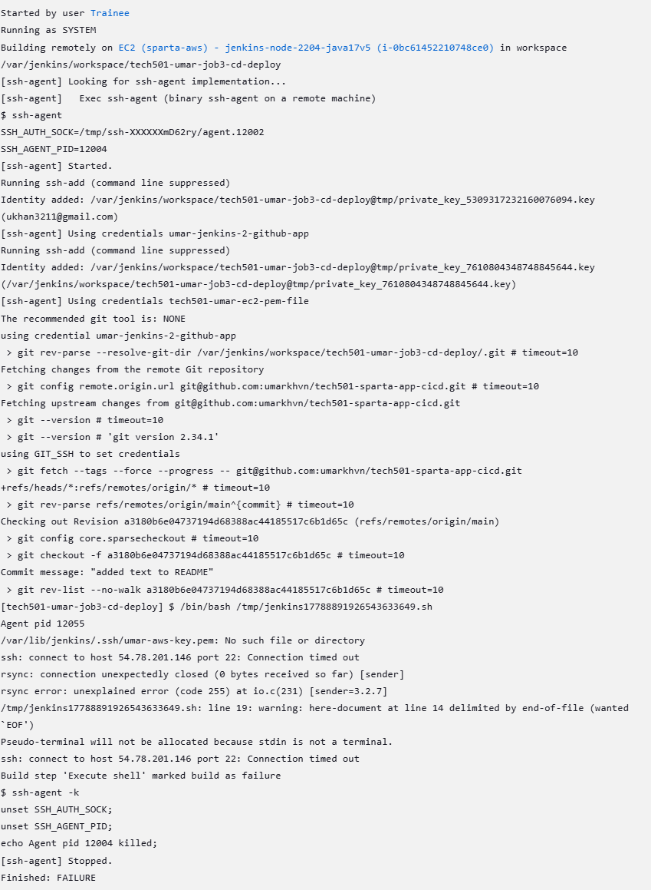

- [Jenkins Labs](#jenkins-labs)
  - [Creating a Project (Pipeline)](#creating-a-project-pipeline)
    - [Steps:](#steps)
  - [Creating a Multi-Stage Pipeline](#creating-a-multi-stage-pipeline)
    - [Steps:](#steps-1)
- [Jenkins - CI/CD Pipeline for Sparta Test App](#jenkins---cicd-pipeline-for-sparta-test-app)
    - [Setting Up a New Repo with App Code](#setting-up-a-new-repo-with-app-code)
- [Creating Jenkins Credentials for GitHub Access](#creating-jenkins-credentials-for-github-access)
    - [Steps:](#steps-2)
    - [Adding Public Key to GitHub](#adding-public-key-to-github)
- [Setting Up Job 1](#setting-up-job-1)
    - [Steps:](#steps-3)
  - [Setting Up Job 2](#setting-up-job-2)
    - [Create Dev Branch](#create-dev-branch)
    - [Create a new item:](#create-a-new-item)
  - [Setting Up Job 3: EC2 CD Deployment](#setting-up-job-3-ec2-cd-deployment)
    - [Blockers](#blockers)
  - [Next Steps](#next-steps)


# Jenkins Labs

## Creating a Project (Pipeline)
Creating a project is the same as creating a pipeline.

### Steps:
1. Create a new item (new pipeline):
   - Name: `tech501-umar-first-project`
   - Freestyle project.
   - Click **OK**.
2. Description: *Testing Jenkins.*
3. Enable "Discard old builds" option:
   - Max builds = **5**.
4. Add build step:
   - **Execute Shell**
   - Command: `date` (Gives details the time and date.)
5. Save.
6. Click **Build Now** on the left.
7. In the dashboard, the job you created will be in a build queue. This will be until worker nodes are spun up to run the jobs.
8. When worker nodes are idle for a specific amount of time, they are removed by Jenkins.
9. To review your job:
   - Click on `#1` in **Build History** → **Console Output**.
   - This shows details of what happened when the job ran, including the `date` command output.


## Creating a Multi-Stage Pipeline
You can link jobs together so that they run one after another, forming a multi-stage pipeline.

### Steps:
1. Go to your first project job.
2. **Post-build actions** → **Build Other Projects**.
3. Specify the `umar-get-date` project.
   - Ensure there is no comma or space at the end.
4. Select **Trigger only if build is stable** (ensures the next job runs only if the first one is successful).
5. Click **Build Now** on the first project.
6. In the **Console Output** of first build `#2`, you should see that it triggered the next project.
7. In the **Console Output** of the second project, you should see that it was triggered by the first project.

---

# Jenkins - CI/CD Pipeline for Sparta Test App

### Setting Up a New Repo with App Code

1. **Create a new GitHub repository:**
   - Name: `tech501-sparta-app-cicd`
   - Set as **Public**.
2. **On local machine:**
   ```bash
   cd ~/Documents/github
   mkdir tech501-sparta-app-cicd
   cd tech501-sparta-app-cicd
   git clone https://github.com/umarkhvn/tech501-sparta-app repo
   unzip nodejs20-sparta-test-app.zip 
   rm nodejs20-sparta-test-app.zip
   git init
   git branch -M main
   git remote set-url origin https://github.com/umarkhvn/tech501-sparta-app-cicd.git
   git add .
   git commit -m "Initial commit"
   git push -u origin main
   ```

---

# Creating Jenkins Credentials for GitHub Access

### Steps:
1. In local Git Bash terminal:
   ```bash
   ssh-keygen -t rsa -b 4096 -C "ukhan3211@gmail.com"
   ```
2. Name: `umar-jenkins-2-github-app`
3. **Private Key:** Needs to be on the Jenkins server.
4. **Public Key:** Needs to be added to GitHub repo.

### Adding Public Key to GitHub
1. Go to **GitHub → Repo Settings → Deploy Keys**.
2. Click **Add Key**.
3. Name: `umar-jenkins-2-github-app`
4. In Git Bash:
   ```bash
   cat ~/.ssh/umar-jenkins-2-github-app.pub
   ```
5. Paste the contents into GitHub.
6. Enable **Write Access**.

---

# Setting Up Job 1

### Steps:
1. **Enter Jenkins:** `http://34.254.6.118:8080/`
2. **Create a new item:**
   - Name: `tech501-umar-job1-ci-test`
   - Discard old builds → Max builds = **5**
   - Description: *CI with GitHub webhook*
3. **GitHub Project:**
   - Enter repo URL: `https://github.com/umarkhvn/tech501-sparta-app-cicd/`
4. **Source Code Management - Git:**
   - Use SSH URL: `git@github.com:umarkhvn/tech501-sparta-app-cicd.git`
   - Add Jenkins credentials:
     - Kind: **SSH username with private key**
     - ID: `umar-jenkins-2-github-app`
     - Description: Optional
     - Username: `umar-jenkins-2-github-app`
     - Paste private key using `cat` command.
5. **Branches to build:** `*/main`
6. **Build Environment:**
   - Check "Provide Node & npm bin/ folder to PATH"
   - Use **Node.js v20**
7. **Build Steps - Execute Shell:**
   ```bash
   cd app
   npm install
   npm test
   ```
8. Save & Build Now.
9. Check **Console Output**.

## Setting Up Job 2

### Create Dev Branch

Change the Main branch to Dev in Git Bash (local):

* Navigate to repo:
  * `cd OneDrive/SpartaGlobal/Documents/github/tech501-sparta-app-cicd`
* Change branch:
  * `git checkout -b dev`
  * OR `git branch -M dev`
* In git bash:
    * `nano README.md`
* Make a change to it and save so we can test the dev branch. This must be done otherwise the changes won't be updated 
    * `git add .`
    * `git commit -m "dev commit"`
    * `git push origin dev`

### Create a new item:
* Name:
  * tech501-umar-job2-ci-merge

* In Job Config: 
  * change branch specifier to */dev from */main.

* Build triggers:
  - Build after other projects are built
  - Enter Job 1: tech501-umar-job1-ci-test
  - Trigger only if build is stable.

In source code management:
- Add Git URL and credentials
- SSH link: git@github.com:umarkhvn/tech501-sparta-app-cicd/

In build environment:
- Enable SSH agent and specify credentials.

Add a build step - execute shell script:

`git checkout main`

`git pull origin main`

`git merge --ff-only origin/dev`

`git push origin main`


Save and Build Now

## Setting Up Job 3: EC2 CD Deployment 

### Blockers
* Need to ensure proper SSH key and EC2 instance connectivity.
* I was not able to create a pipeline to automate EC2 deployment. I was met with the following error:



## Next Steps
* Troubleshoot Job 3 deployment issues
* Ask peers for assistance
* External research
